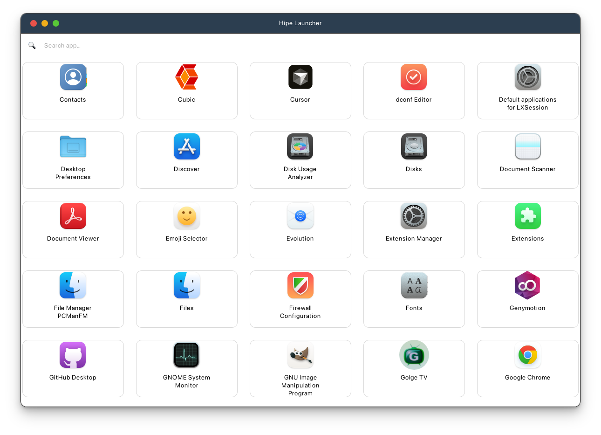

# HIPE LAUNCHER: Simple App Launcher

Hipe Launcher is a lightweight and user-friendly application launcher for Linux systems. It allows you to quickly find and launch your favorite applications with ease.

---

## Features ✨

- Fast and efficient application launching
- Simple and intuitive user interface
- Lightweight and minimal resource usage
- Easy installation and uninstallation process
- Supports most Linux desktop environments

---

## Installation 

```bash
git clone https://github.com/YusufErdemK/hipelauncher.git
cd hipelauncher
chmod +x install.sh
./install.sh
pip3 install -r requirements.txt
```

### Requirements
- Python 3 or higher

---

## Uninstallation

```bash
./install.sh -u
```

---

## Usage

You can launch Hipe Launcher from your application menu or by running the following command in your terminal:

```bash
hipe-launcher
```


## Screenshot



## How It Works

Hipe Launcher scans your system for installed applications and creates a searchable list. You can type the name of the application you want to launch, and Hipe Launcher will display matching results in real-time. Simply select the desired application and hit Enter to launch it.

---

## License

MIT License - see LICENSE file for details

---

## Author
Developed by erdamn (Yusuf Erdem Kaymak)

## Social Medias

[](https://github.com/YusufErdemK)&nbsp;&nbsp;
[](https://www.instagram.com/theyee1903/)


